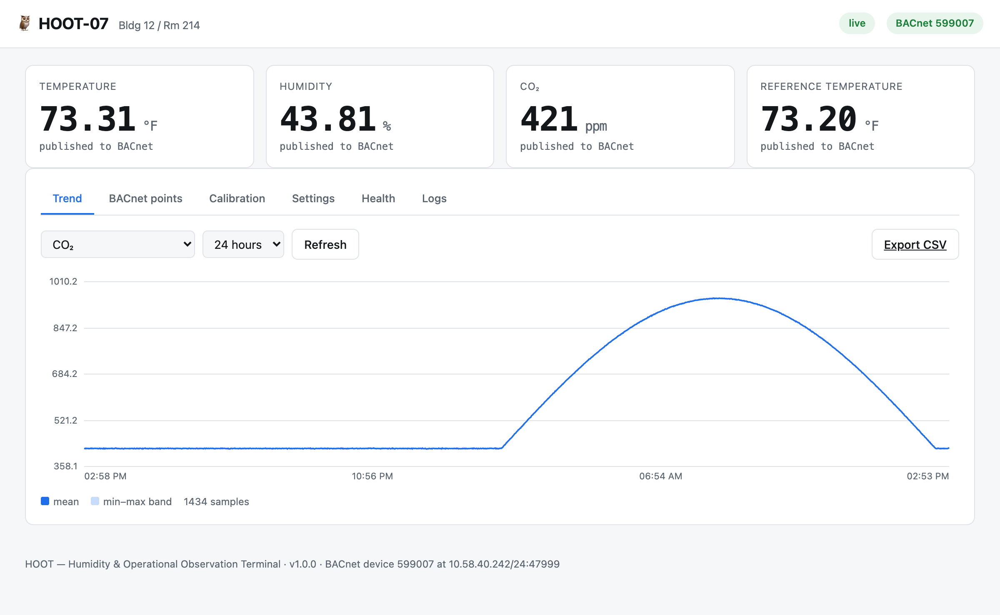
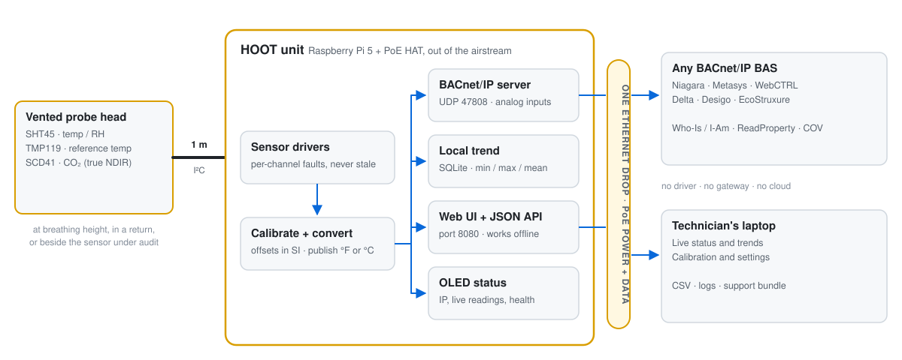
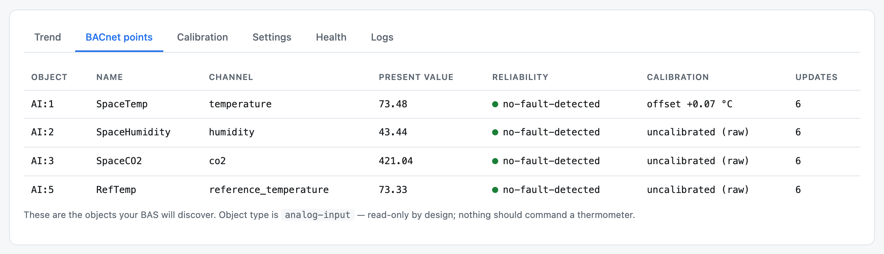
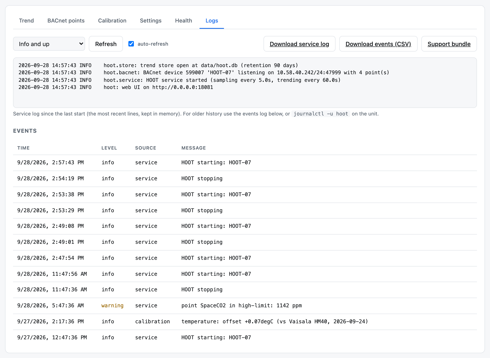
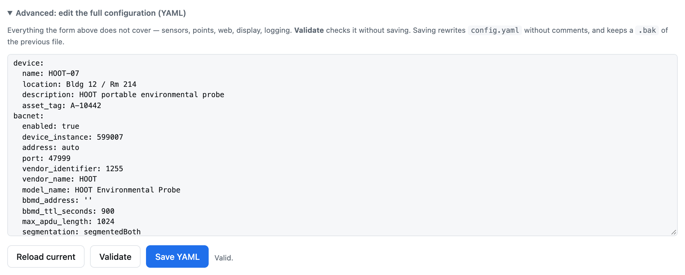
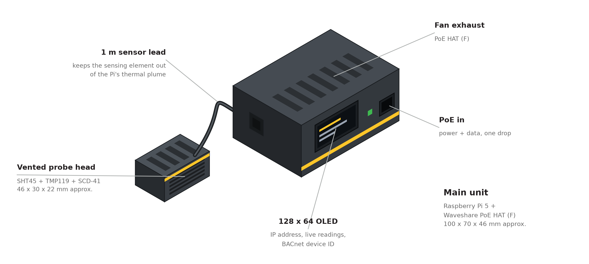

<p align="center">
  <picture>
    <source media="(prefers-color-scheme: dark)" srcset="docs/images/banner-dark.svg">
    
  </picture>
</p>

<p align="center">
  <a href="https://github.com/KSU-PlantOps/hoot/actions/workflows/ci.yml"></a>
  <a href="https://github.com/KSU-PlantOps/hoot/releases/latest"></a>
  
  
  <a href="LICENSE"></a>
</p>

<p align="center">
  <b>Point it at Niagara, Metasys, WebCTRL, Delta, Desigo or EcoStruxure.<br>
  No driver, no gateway, no vendor cooperation, no cloud.</b>
</p>

<p align="center">
  <a href="#quick-start">Quick start</a> ·
  <a href="#how-it-works">How it works</a> ·
  <a href="#what-your-bas-sees">What your BAS sees</a> ·
  <a href="#web-ui">Web UI</a> ·
  <a href="#hardware">Hardware</a> ·
  <a href="#documentation">Docs</a>
</p>

---

HOOT is a portable, PoE-powered **temperature, humidity and CO₂ probe** built on a
Raspberry Pi 5. Plug it into one Ethernet drop and it shows up on your building automation
system as a standard **BACnet/IP device**. It keeps its own trend and is set up from a web page.

Use it to audit a space sensor, settle a comfort complaint, check ventilation, or give your
integrator a live device to build graphics against before a single unit is mounted.

<picture>
  <source media="(prefers-color-scheme: dark)" srcset="docs/images/dashboard-dark.png">
  
</picture>

## Highlights

- 🦉 **Speaks plain BACnet/IP.** Readings are `analog-input` objects with real units, COV
  and alarm limits. `address: auto` detects the netmask too, so discovery just works.
- 🌡️ **Measures the room, not the Pi.** The sensors sit in a vented head on a 1 m lead,
  out of the Pi's heat: SHT45 (±0.1 °C, ±1 % RH), SCD41 true NDIR CO₂, and an optional
  TMP119 that cross-checks the temperature.
- 🚨 **Faults look like faults.** A failed sensor sets `reliability` and the fault flag.
  HOOT never keeps publishing a stale value that looks healthy.
- 📈 **Keeps its own history.** A local 90-day trend records min / max / mean between
  samples, so a 60 s trend still catches a 10 s spike. It survives with no BAS attached.
- 🖥️ **Web UI that works offline.** Live readings, trends, calibration, settings, logs, CSV
  export and a one-click support bundle. It needs no internet and no install.
- 🧪 **Runs with no hardware.** A built-in simulator drives the whole stack, BACnet
  included, from a laptop.

---

## Quick start

### On a Raspberry Pi

```bash
git clone https://github.com/KSU-PlantOps/hoot.git
cd hoot
sudo ALTITUDE_M=300 ./deploy/install.sh     # your site's elevation, for CO₂ compensation
```

Then open `http://<pod-ip>:8080`. The OLED on the unit shows the address.

The installer does the following:
- creates a service user and builds a virtualenv
- enables I²C at 50 kHz, the right speed for a 1 m probe lead
- writes a config with a device instance derived from the Pi's serial number
- installs a hardened systemd unit

Run `hoot selftest` before you mount the unit.

### On a laptop, with no hardware

```bash
python3 -m venv .venv && .venv/bin/pip install -r requirements.txt
.venv/bin/python -m hoot init --simulate
.venv/bin/python -m hoot run                # web UI on :8080, BACnet on UDP 47808
```

The simulator produces a daily temperature swing, humidity that moves the opposite way, and
CO₂ that follows an occupancy curve. Your BAS integrator can discover it, trend it and build
graphics against it today.

---

## How it works

<picture>
  <source media="(prefers-color-scheme: dark)" srcset="docs/images/architecture-dark.svg">
  
</picture>

Every few seconds HOOT reads the sensors, applies calibration, and converts to °F or °C. It
then updates the BACnet objects, adds the reading to the local trend and refreshes the web
UI. Every stage is built to fail visibly. A missing sensor becomes a BACnet fault, and a
disconnected screen is simply skipped. A bad channel never takes the healthy ones down with it.

### Why the sensor is on a cable

This is the design decision everything else follows from.

A Raspberry Pi gives off several watts of heat. Any sensor mounted *on* it (a Sense HAT, a
GPIO breakout) sits in that heat. The documented error on a Sense HAT is **around +17 °C /
+30 °F at idle**, and it climbs under load. The usual fix is to subtract a fraction of the
CPU temperature:

```python
t_corrected = t - (t_cpu - t) / factor    # don't
```

That is a curve fitted to one unit, in one enclosure, at one CPU load and one airflow.
Change any of them and it drifts. A reference probe that can't hold a calibration isn't a
reference probe. A probe that reads 30 °F high while *looking* healthy is worse than none,
because someone will act on it.

So HOOT puts the sensors in a small vented head on a 1 m lead. It costs about $10 more,
and it measures the room and holds a calibration. It's also a better field tool: hang the
head at breathing height, clip it to a diffuser, drop it in a return, or tape it beside
the sensor you're auditing.

HOOT still *supports* a Sense HAT, but that driver is flagged `uncalibrated`. The service
won't publish its readings to BACnet unless you set `allow_uncalibrated: true`, and the
warning travels with the reading into the web UI.

---

## What your BAS sees

```text
$ hoot points
BACnet device 599001  "HOOT-01"
  vendor 999 (HOOT)
  address auto:47808
  location Bldg 12 / Rm 214

  OBJECT          NAME                UNITS                     COV     DESCRIPTION
  ----------------------------------------------------------------------------------------------------
  analog-input,1  SpaceTemp           degreesFahrenheit         0.1     Space dry-bulb temperature
  analog-input,2  SpaceHumidity       percentRelativeHumidity   0.5     Space relative humidity
  analog-input,3  SpaceCO2            partsPerMillion           10.0    Space CO2 concentration
  analog-input,4  ProbeHeadTemp       degreesFahrenheit         0.5     DIAGNOSTIC ONLY - SCD41 internal temp, self-heated
```

Readings are **analog-input** objects, not analog-value. AI means "a physical sensor
reading", and most BAS tools treat it as read-only by default. Nothing should be
commanding a thermometer.

<p align="center">
  <picture>
    <source media="(prefers-color-scheme: dark)" srcset="docs/images/points-dark.png">
    
  </picture>
</p>

### Faults are real faults

When a sensor read fails, HOOT does **not** keep publishing the last good value. It sets
`reliability` (`communication-failure`, `no-sensor`, …) and raises the fault flag in
`statusFlags`. Your workstation shows the point as unreliable instead of trending a
believable but wrong number.

This matters more than it sounds. A stale value that looks healthy is how a dead sensor ends
up justifying a control decision for three weeks.

Per-BAS setup notes for Niagara, Metasys, WebCTRL and others are in
**[docs/BAS-INTEGRATION.md](docs/BAS-INTEGRATION.md)**.

---

## Web UI

Everything a technician needs is at `http://<pod-ip>:8080`, from a laptop on the BAS VLAN.
It needs no internet and no install.

| Tab | What it's for |
|---|---|
| *(cards)* | Live readings, and whether each one is published to BACnet |
| **Trend** | Local trend chart (1 h – 30 days) with min–max band; CSV export |
| **BACnet points** | The object list your BAS will discover, with reliability and update counts |
| **Calibration** | Single-point calibration against a reference instrument |
| **Settings** | Timing, identity, BACnet and alarm limits; download `config.yaml`; edit the full YAML config with *Validate* before *Save* |
| **Health** | Uptime, read errors, trend writes, the SHT45 / TMP119 cross-check |
| **Logs** | Live service log, the persistent event log, and downloads (service log, events CSV, support bundle) |

<p align="center">
  <picture>
    <source media="(prefers-color-scheme: dark)" srcset="docs/images/logs-dark.png">
    
  </picture>
</p>

The **support bundle** is one zip with `config.yaml`, `status.json`, `service.log` and
`events.csv`. Attach it when you ask someone else to look at a unit.

<details>
<summary><b>Full YAML config editor</b></summary>
<br>
<picture>
    <source media="(prefers-color-scheme: dark)" srcset="docs/images/settings-yaml-dark.png">
    
  </picture>

Everything the Settings form doesn't cover (sensors, points, web, display, logging) can be
edited here. **Validate** checks the config without saving it. **Save** writes it
atomically, keeps a `.bak`, applies what it can immediately, and tells you when a restart
is needed.
</details>

<details>
<summary><b>JSON API</b></summary>

Everything in the UI is also an API. Interactive docs are at `/api/docs` on the unit.

```
GET  /api/status                 live readings, BACnet points, health, warnings
GET  /api/config  | POST         config as JSON (what the Settings form uses)
GET  /api/config.yaml | POST     full config as YAML; POST ?dry_run=true to validate only
POST /api/calibrate              single- or two-point calibration
GET  /api/history?channel=co2    trend rows (long windows are downsampled)
GET  /api/export.csv?hours=24    trend data as CSV
GET  /api/logs?level=WARNING     recent service log lines
GET  /api/logs/download          service log as a .log file
GET  /api/events | /events.csv   persistent event log
GET  /api/support-bundle.zip     config + status + logs + events
GET  /api/health                 unauthenticated liveness probe (200 / 503)
```
</details>

The service log view holds the last 5,000 lines since the service started. Older history is
in the event log, or in `journalctl -u hoot` on the unit.

> [!IMPORTANT]
> The web UI has **no login by default**, which is fine only on an isolated BAS VLAN.
> Anywhere else, set `web.auth_enabled: true` and supply `HOOT_WEB_PASSWORD`. See
> [SECURITY.md](SECURITY.md).

---

## Configuration

Everything lives in `config.yaml`. The web UI reads and writes the same file, and
[`config.example.yaml`](config.example.yaml) is the version with every setting commented.

```yaml
device:
  name: "HOOT-01"
  location: "Bldg 12 / Rm 214"

bacnet:
  device_instance: 599001    # MUST be unique on your internetwork
  address: "auto"            # detects the interface AND its real netmask
  port: 47808

units:
  temperature: "degF"

sensors:
  - driver: sht4x
  - driver: tmp11x             # optional cross-check for the SHT45
  - driver: scd4x
    options: {altitude_m: 300, automatic_self_calibration: false}

points:
  - {channel: temperature, name: SpaceTemp,     instance: 1, cov_increment: 0.1}
  - {channel: humidity,    name: SpaceHumidity, instance: 2, cov_increment: 0.5}
  - {channel: co2,         name: SpaceCO2,      instance: 3, cov_increment: 10.0, high_limit: 1100}

sampling:  {interval_seconds: 5.0}    # also the BACnet update rate
logging:   {interval_seconds: 60.0, retention_days: 90}
```

> [!TIP]
> **`address: auto` detects the netmask, not just the IP.** BACnet's Who-Is and I-Am are
> broadcasts to the subnet. With the wrong prefix length, the device answers direct reads
> but never shows up in a discovery scan. It's the most common and most confusing BACnet/IP
> mistake. If you set the address by hand, the prefix is required, and HOOT refuses an
> address without one.

- **Sampling and trending are separate on purpose.** The BAS wants live values every few
  seconds. A 90-day local trend at 5 s would be about 1.5 M rows per channel for no
  benefit, so the trend stores min / max / mean between writes instead.
- **Different subnet from the BAS?** Set `bacnet.bbmd_address` and HOOT registers as a
  foreign device. Without it, broadcasts don't cross the router and discovery can't find
  the unit.

---

## Calibration

HOOT is meant to *settle arguments*, so its readings have to trace back to a known reference.

Open the web UI's **Calibration** tab. Sit the probe head next to a reference instrument,
let both settle for 10–15 minutes, and enter what the reference reads. You can also do it
through the API:

```bash
curl -X POST http://pod:8080/api/calibrate \
  -H 'Content-Type: application/json' \
  -d '{"channel":"temperature","reference":71.8,"note":"vs Fluke 971, 2026-09-08"}'
```

Offsets are stored in **SI units**, so switching the display between °F and °C never
invalidates a calibration. Two-point calibration (gain and offset) is available through the
API for work across a wider range. Also read why the SHT45 usually needs *verification*
rather than correction: **[docs/CALIBRATION.md](docs/CALIBRATION.md)**.

---

## CLI

| Command | What it does |
|---|---|
| `hoot run` | Start the service (what systemd runs) |
| `hoot init` | Write a starter config for this unit |
| `hoot read` | One-shot sensor read. Safe on a unit that's in service |
| `hoot selftest` | Pre-flight check: config, sensors, points, BACnet bind, storage |
| `hoot points` | Print the BACnet object list, to hand to your integrator |
| `hoot export` | Dump the local trend to CSV |

`hoot selftest` is the one to run before mounting a unit. Check that the broadcast address
is right for the subnet:

```text
=== BACnet ===
  OK   bound 10.10.0.100 on 10.10.0.0/23 (broadcast 10.10.1.255)
  OK   device instance 599001, 4 object(s)
```

---

## Hardware

<p align="center">
  
</p>

About **$245 per unit** at 2026 retail prices. The full bill of materials, part rationale
and assembly notes are in **[docs/HARDWARE.md](docs/HARDWARE.md)**.

| Part | Why |
|---|---|
| Raspberry Pi 5, 2 GB | Plenty for this workload, and far less exposed to memory pricing |
| **Waveshare PoE HAT (F)** | Has a GPIO stacking header, which the official Pi 5 PoE HAT lacks |
| Adafruit SHT45 | ±0.1 °C / ±1 % RH, individually factory calibrated |
| Adafruit TMP119 *(optional)* | ±0.08 °C max; a second temperature sensor that works a different way, to catch drift |
| Adafruit SCD-41 | Photoacoustic NDIR: real CO₂, not an "eCO₂" estimate |
| 128×64 OLED | Shows the IP address, readings and BACnet ID on the unit itself |

> [!NOTE]
> Use the **Waveshare PoE HAT (F)**, not the official Raspberry Pi one. The original PoE+
> HAT doesn't fit a Pi 5. The Pi 5 version has no fan and no documented GPIO passthrough,
> and HOOT needs the GPIO pins for the sensor head and the OLED.

---

## Documentation

| Document | Covers |
|---|---|
| [docs/HARDWARE.md](docs/HARDWARE.md) | Bill of materials, part choices, I²C over a 1 m cable, assembly |
| [docs/CALIBRATION.md](docs/CALIBRATION.md) | Bench acceptance, verification vs calibration, CO₂ re-anchoring, tuning |
| [docs/BAS-INTEGRATION.md](docs/BAS-INTEGRATION.md) | Discovery, BBMDs, instance numbering, Niagara / Metasys / WebCTRL notes |
| [config.example.yaml](config.example.yaml) | Every setting, commented |
| [SECURITY.md](SECURITY.md) | Deployment model and reporting vulnerabilities |
| [CHANGELOG.md](CHANGELOG.md) | What changed in each release |

---

## Development

```bash
pip install -r requirements.txt -e ".[dev]"
ruff check hoot tests
pytest                       # no hardware required
hoot init --simulate && hoot run
```

Adding a sensor means writing one class:

```python
class MyDriver(SensorDriver):
    key = "mysensor"

    @property
    def channels(self): ...
    def read(self) -> Sample: ...
```

Report values in SI units (°C, %RH, ppm, hPa). Put per-channel errors in `Sample.errors`
rather than raising, so one bad channel can't take the healthy ones down. Register the
driver in `hoot/sensors/__init__.py`.

CI runs on Python 3.11–3.13. Raspberry Pi OS Bookworm ships 3.11, so don't use newer
syntax. See [CONTRIBUTING.md](CONTRIBUTING.md). The README images are generated; see
[docs/images/src](docs/images/src/README.md) to rebuild them.

---

## License

MIT. See [LICENSE](LICENSE).
